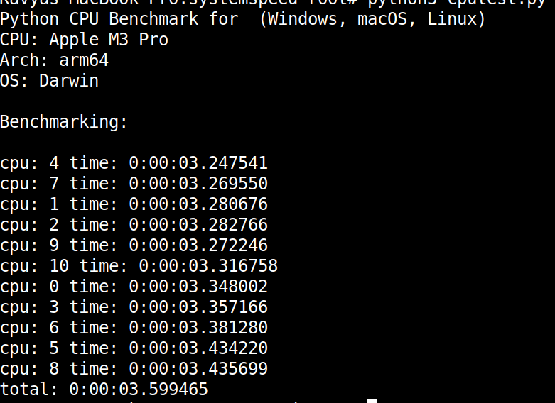
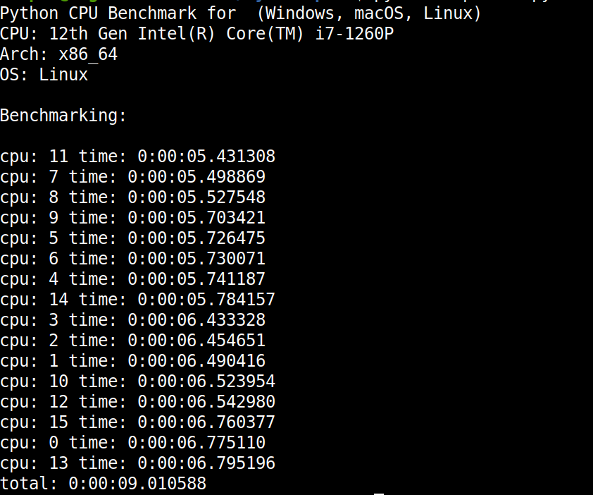

# Systemspeed
This repository serves as an inspiration for a straightforward and relaible script that uses math computations like (add,sub,mult,div,sha256) to provide CPU and GPU speeds.

This script nearly has 8 million calculations that will happen when you run it. you can tweak this using the variables that are decalred in the program you can also reapeat same operations according to your needs.
It is tested on the macbook M3 pro and intel processors. 

### Note
And it will put pressure on  all cores.So play responsibly.If it is taking lot of time hit ctrl+c to stop the program 

## How to Run
[+]`git clone https://github.com/deepakvamsi/systemspeed.git`

[+]`cd systemspeed`

[+]`python3 cputest.py`

### Macbook m3-pro

### Intel I7-1260p

### Special Thanks
[alexdedyura](https://github.com/alexdedyura)
